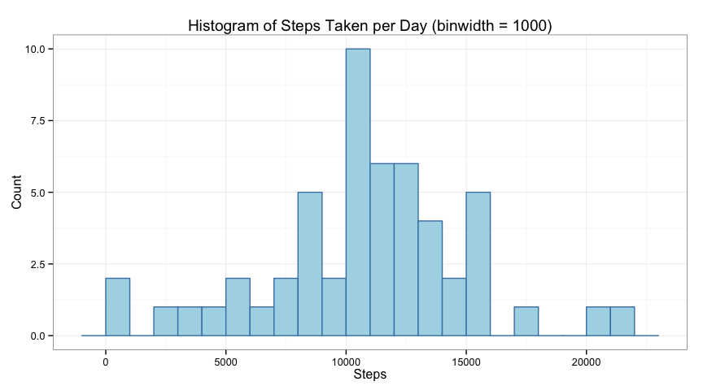
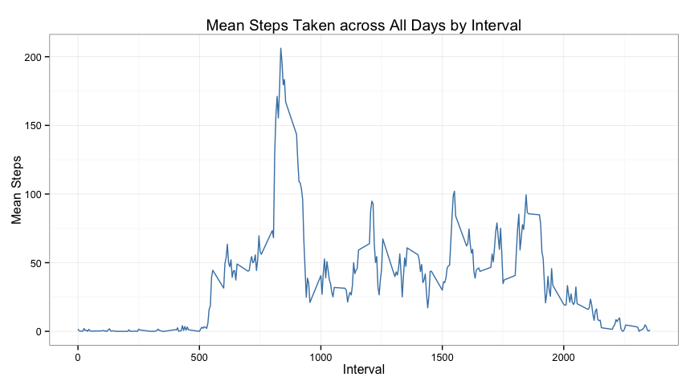

# Reproducible Research: Peer Assessment 1

## Executive Summary

Data from a personal activity monitoring device recorded a mean total number of steps taken per day of 10,766. The average activity shows a pattern of early inactivity, followed by an initial large peak with a few smaller peaks throughout the day until settling to low levels. When the missing values in the data set were imputed and the data were split according to weekday or weekend day, it becomes apparent that the initial large peak is greatest on the weekdays, whereas the weekends showed greater activity throughout the day and settled to low-level activity at a later interval.

## Analysis


The data for this analysis is from a personal activity monitoring device, which recorded the number of steps taken by a single anonymous individual during five minute intervals throughout the day and span October and November of 2012. There are a total of 17,568 observations in the data set.

### Loading and preprocessing the data

The activity monitoring data were downloaded from <https://d396qusza40orc.cloudfront.net/repdata%2Fdata%2Factivity.zip> (accessed: July 10, 2014) and uncompressed.


```r
fileurl <- "https://d396qusza40orc.cloudfront.net/repdata%2Fdata%2Factivity.zip"
filename <- "repdata-data-activity.zip"
datafile <- "activity.csv"

downloadData <- function() {
        if (!file.exists(filename)) {
                download.file(fileurl, dest = filename, method = "curl")
        }
        unzip(filename)
}

downloadData()
```

The data were then read into R as `activity` with the data types of the three variables (steps, date, and interval) specified by the `colClasses` argument.


```r
cols <- c("numeric", "Date", "integer")
activity <- read.csv("activity.csv", header = TRUE, colClasses = cols)
```

### What is mean total number of steps taken per day?

To find the total number of steps taken per day, the activity monitor data set was `split()` by the `date` variable. The sum of the `steps` variable was taken from the resulting list of 61 days.


```r
perday <- split(activity, activity$date)
stepsperday <- unsplit(sapply(perday, function(perday) { sum(perday$steps) }), names(perday))
```

The following is a histogram of the total number of steps taken each day. A `binwidth` of 1000 steps shows the spread and definition of the distribution.


```r
h <- ggplot(data = data.frame(stepsperday), aes(x = stepsperday))
h + geom_histogram(binwidth = 1000, colour = "steel blue", fill = "light blue") + 
        labs(list(title = "Histogram of Steps Taken per Day (binwidth = 1000)", x = "Steps", y = "Count")) + 
        theme_bw()
```

 

There are few days at the extremes (below 5,000 steps taken per day or greater than 20,000 steps). But most of the data center around the 10,000 steps. 

The mean number of steps taken per day is 10,766, and the median is 10,765.


```r
mean(stepsperday, na.rm = TRUE)
```

```
## [1] 10766
```


```r
median(stepsperday, na.rm = TRUE)
```

```
## [1] 10765
```

### What is the average daily activity pattern?

A function `interval.machine` was written to split the `activity` data set according to the `interval` variable then average the number of steps for each interval across the days of the monitor data.


```r
interval.machine <- function(data) {

        interval <- split(data, data$interval)
        meanday.interval <- data.frame()

        for(i in 1:288) {
                int <- data.frame(interval[[i]][1])
                meanday <- mean(int$steps, na.rm = TRUE)
                meanday.interval <- rbind(meanday.interval, c(interval[[i]][1, 3], meanday))
        }
        
        names(meanday.interval) <- c("interval", "mean.steps")
        meanday.interval
}
```

The `interval.machine` function was run on the `activity` data set to produce `marco.polo` (named after the famous 13th-14th cent. compulsive step-counter and Fitbit earliest-adopter). A time series plot of his travels shows a large peak in activity near interval 800 and three peaks of half that size later in the day.


```r
marco.polo <- interval.machine(activity)

l <- ggplot(data = marco.polo, aes(x = interval, y = mean.steps))
l + geom_line(colour = "steel blue") + 
        labs(list(title = "Mean Steps Taken across All Days by Interval", x = "Interval", y = "Mean Steps")) + 
        theme_bw()
```

 

The maximum is 206.1698 steps, which occurs at the 835 interval.


```r
max(marco.polo$mean.steps)
```

```
## [1] 206.2
```

```r
marco.polo[marco.polo$mean.steps == max(marco.polo$mean.steps), 1]
```

```
## [1] 835
```

### Imputing missing values

There are 2,304 missing values coded as "NA" in the original data set `activity`.


```r
sum(is.na(activity))
```

```
## [1] 2304
```

These missing values were replaced with the mean values for each interval across all days of the activity monitoring.


```r
impute <- activity

for(i in 1:length(impute$steps)) {
        if(is.na(impute$steps[i])) {
                impute$steps[i] <- mean(impute$steps[impute$interval == impute$interval[i]], na.rm = TRUE)
        }        
}
```

There are no missing values in the imputed data set `impute`.


```r
sum(is.na(impute))
```

```
## [1] 0
```

The total number of steps taken for each of the 61 days was calculated again, this time using the imputed data set.


```r
impute.perday <- split(impute, impute$date)
impute.stepsperday <- unsplit(sapply(impute.perday, function(impute.perday) { sum(impute.perday$steps) }), names(impute.perday))
```

In comparison to the hisotgram for the original `activity` data set, the histogram for `impute` shows the increased number of mean-level values in the distribution.


```r
h2 <- ggplot(data = data.frame(impute.stepsperday), aes(x = impute.stepsperday))
h2 + geom_histogram(binwidth = 1000, colour = "dark red", fill = "#f25620") + 
        labs(list(title = "Histogram of Steps Taken per Day with Imputed Values (binwidth = 1000)", x = "Steps", y = "Count")) + 
        theme_bw()
```

 

Both the mean and median of the imputed data set equal 10766.19. The mean is identical to the original data set. The median has increased and now equals the mean.


```r
mean(impute.stepsperday)
```

```
## [1] 10766
```

```r
median(impute.stepsperday)
```

```
## [1] 10766
```

### Are there differences in activity patterns between weekdays and weekends?

A new variable that labels the date as either a weekday or weekend day was created using the `weekedays()` command.


```r
impute$day <- "weekday"
weekend <- c("Saturday", "Sunday")

for(i in 1:length(impute$date)) {
        if(weekdays(impute$date[i], abbreviate = FALSE) %in% weekend) {
                impute$day[i] <- "weekend"
        }
}
```

The `carrot.top` function was used to create a new data set, `d.list`, via `prop.humor` and `excessive.weightlifting`. `d.list` includes a variable `steps` for the mean number of steps taken, averaged across all weekdays or weekend days by the `interval.machine()` function from step 3.


```r
carrot.top <- function(data, k = c("weekday", "weekend")) {
        prop.humor <- subset(data, data$day == k)
        excessive.weightlifting <- interval.machine(prop.humor)
        excessive.weightlifting$day <- as.factor(k)
        excessive.weightlifting
}

d.list <- rbind(carrot.top(impute, "weekday"), carrot.top(impute, "weekend"))
```

To assess any differences between mean weekday and weekend activity, a time series plot with two panels was created.


```r
l <- ggplot(data = d.list, aes(x = interval, y = mean.steps))
l + geom_line(colour = "#f25620") + 
        facet_grid(day ~ .) +
        labs(list(title = "Mean Steps by Interval, Comparing Weekdays and Weekend Days", x = "Interval", y = "Mean Steps")) + 
        theme_bw()
```

 

The initial peak is greater on weekdays than weekends, as is the activity leading up to this peak. The weekend plot shows greater step activity throughout the day, with more medium-sized peaks. In addition, the weekend activity settles to low levels at a later interval than does the weekday activity.
